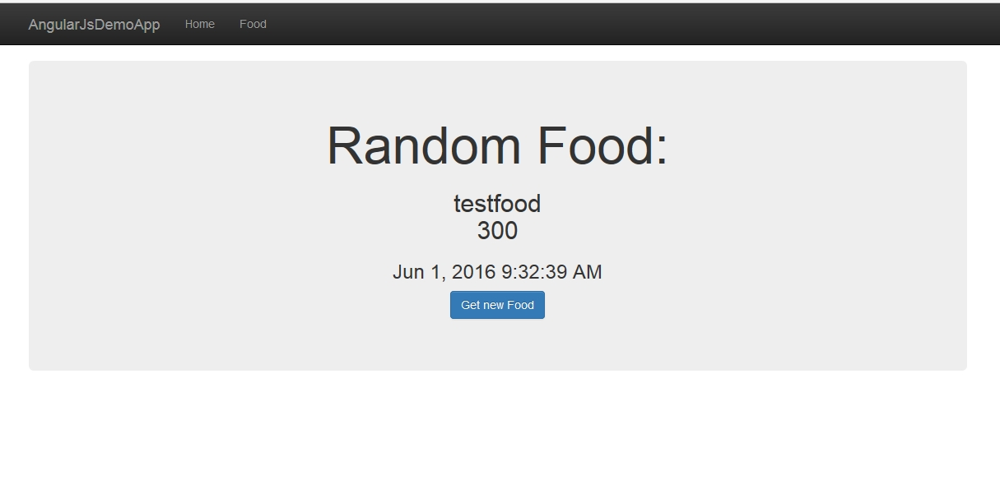
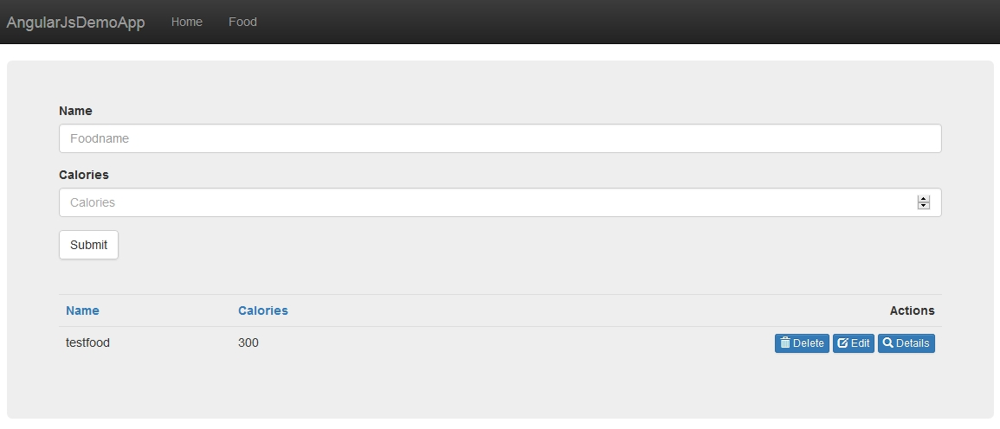

# Angular Demo-Application

In this repository we take everything we have learned so far an put it all together in one single app.

This application comes with forms, validation, routing etc.

## Screens

### Home

### Form

